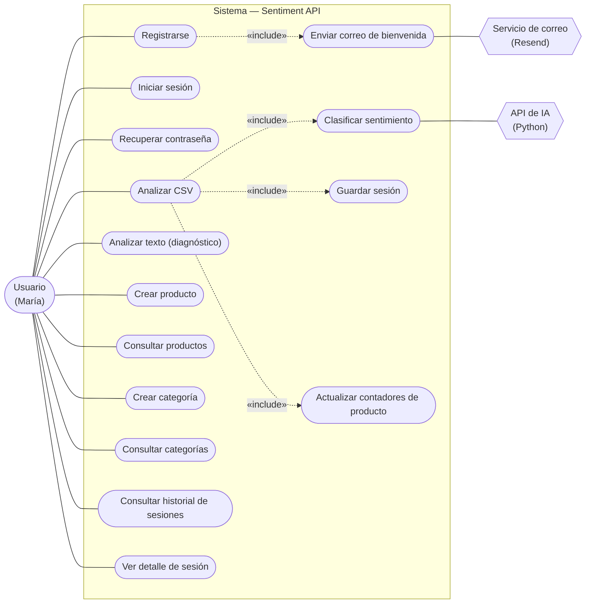

# ESTRUCTURA DEL PROYECTO — Sentiment API

> Documento de arquitectura: estructura de paquetes real (completa), **Diagrama de Casos de Uso**
> y **Diagrama de Clases arquitectónico** (las 4 capas de Clean Architecture y sus relaciones).
>
> **Nota:** los diagramas están en **Mermaid**; se renderizan automáticamente en GitHub y en VS Code
> (extensión *Markdown Preview Mermaid*) / IntelliJ con el plugin de Mermaid.
>
> **Aclaración sobre "Crear / Consultar / Actualizar / Cancelar reserva":** este proyecto **no gestiona
> reservas** — es un sistema de **análisis de sentimiento**. Ese enunciado CRUD genérico se adapta aquí a
> las entidades reales del sistema (Producto y Categoría, que sí tienen crear/consultar/actualizar) y a
> los flujos principales (autenticación, análisis de CSV, historial). Ver la tabla de mapeo en §3.

---

## 1. Contexto del backend

Este documento describe **únicamente el backend** (`sentiment-backend-java`), construido con
**Spring Boot** y **Clean Architecture**. Expone una API REST (context-path `/project/api/v2`),
persiste en **PostgreSQL** y delega la clasificación de sentimiento en una **API de ML externa**
(servicio actor en los diagramas). Tecnología: Java 22, Spring Boot, Spring Data JPA, Spring Security
(JWT), WebClient.

---

## 2. Estructura de paquetes real y completa

Raíz de paquetes: `com.project.sentimentapi`

```
com.project.sentimentapi/
│
├── SentimentapiApplication.java          ← punto de entrada Spring Boot (@SpringBootApplication)
│
├── domain/                               ← CAPA DOMAIN · núcleo puro (no importa Spring ni JPA)
│   ├── model/                            ← POJOs de negocio (sin @Entity)
│   │   ├── Usuario.java
│   │   ├── Rol.java
│   │   ├── Categoria.java
│   │   ├── Producto.java
│   │   ├── Sesion.java
│   │   ├── SesionProducto.java
│   │   ├── Comentario.java
│   │   └── ResultadoSentimiento.java     ← resultado del análisis (prevision + probabilidad)
│   ├── port/out/                         ← PUERTOS DE SALIDA (contratos que el dominio necesita)
│   │   ├── UsuarioRepositoryPort.java
│   │   ├── CategoriaRepositoryPort.java
│   │   ├── ProductoRepositoryPort.java
│   │   ├── SesionRepositoryPort.java
│   │   ├── SesionProductoRepositoryPort.java
│   │   ├── ComentarioRepositoryPort.java
│   │   ├── SentimentAnalysisPort.java    ← contrato hacia la IA (lo implementa infrastructure)
│   │   ├── EmailPort.java                ← contrato hacia el correo
│   │   └── TokenProviderPort.java        ← contrato para emitir JWT (lo implementa JwtUtil)
│   ├── event/
│   │   └── UserRegisteredEvent.java      ← evento de dominio (POJO puro → Observer)
│   └── exception/                        ← excepciones de negocio
│       ├── SentimentApiException.java
│       ├── SesionNoEncontradaException.java
│       ├── TokenExpiradoException.java
│       └── UsuarioNoEncontradoException.java
│
├── application/                          ← CAPA APPLICATION · orquesta el negocio (solo importa domain)
│   ├── port/in/                          ← PUERTOS DE ENTRADA (casos de uso — contratos)
│   │   ├── RegistrarUsuarioUseCase.java
│   │   ├── AutenticarUsuarioUseCase.java
│   │   ├── RecuperarContrasenaUseCase.java
│   │   ├── AnalizarCsvUseCase.java
│   │   ├── AnalizarTextoUseCase.java
│   │   ├── ConsultarSesionesUseCase.java
│   │   ├── GuardarSesionUseCase.java
│   │   ├── GestionarProductoUseCase.java
│   │   └── GestionarCategoriaUseCase.java
│   ├── usecase/                          ← IMPLEMENTACIONES de los casos de uso
│   │   ├── RegistrarUsuarioUseCaseImpl.java
│   │   ├── AutenticarUsuarioUseCaseImpl.java
│   │   ├── RecuperarContrasenaUseCaseImpl.java
│   │   ├── AnalizarCsvUseCaseImpl.java   ← FACADE (coordina IA, sesión, productos, estadísticas)
│   │   ├── AnalizarTextoUseCaseImpl.java
│   │   ├── ConsultarSesionesUseCaseImpl.java
│   │   ├── GuardarSesionUseCaseImpl.java
│   │   ├── GestionarProductoUseCaseImpl.java
│   │   └── GestionarCategoriaUseCaseImpl.java
│   ├── builder/
│   │   └── SesionBuilder.java            ← BUILDER (construcción validada de Sesion)
│   ├── event/
│   │   └── UserRegistrationListener.java ← OBSERVER (reacciona a UserRegisteredEvent → envía correo)
│   ├── mapper/                           ← traducción dominio ↔ DTO
│   │   ├── UsuarioMapper.java
│   │   ├── ProductoMapper.java
│   │   ├── CategoriaMapper.java
│   │   └── SesionMapper.java
│   └── dto/                              ← objetos de frontera (request/response)
│       ├── request/
│       │   ├── RegistroRequestDto.java
│       │   ├── LoginRequestDto.java
│       │   ├── ProductoRequestDto.java
│       │   ├── CsvEntradaDto.java
│       │   ├── CsvUploadRequestDto.java
│       │   ├── CsvBatchRequestDto.java
│       │   └── ComentariosRequestDto.java
│       └── response/
│           ├── LoginResponseDto.java
│           ├── UserDto.java
│           ├── CategoriaDto.java
│           ├── ProductoDto.java
│           ├── ProductoMencionesDto.java
│           ├── ProductoPrevioDto.java
│           ├── SesionDto.java
│           ├── SesionPreviaInfoDto.java
│           ├── ComentarioDto.java
│           ├── CsvAnalysisResponseDto.java
│           ├── SentimentsResponseDto.java
│           └── ResponseDto.java
│
├── infrastructure/                       ← CAPA INFRASTRUCTURE · implementa los contratos del dominio
│   ├── persistence/
│   │   ├── entity/                       ← entidades JPA (@Entity) — separadas del modelo de dominio
│   │   │   ├── UsuarioJpaEntity.java
│   │   │   ├── RolJpaEntity.java
│   │   │   ├── CategoriaJpaEntity.java
│   │   │   ├── ProductoJpaEntity.java
│   │   │   ├── SesionJpaEntity.java
│   │   │   ├── SesionProductoJpaEntity.java
│   │   │   └── ComentarioJpaEntity.java
│   │   ├── repository/                   ← Spring Data JPA (interfaces *JpaRepository)
│   │   │   ├── UsuarioJpaRepository.java
│   │   │   ├── RolJpaRepository.java
│   │   │   ├── CategoriaJpaRepository.java
│   │   │   ├── ProductoJpaRepository.java
│   │   │   ├── SesionJpaRepository.java
│   │   │   ├── SesionProductoJpaRepository.java
│   │   │   └── ComentarioJpaRepository.java
│   │   └── adapter/                      ← ADAPTER (implementan los port/out, mapean JpaEntity ↔ modelo)
│   │       ├── UsuarioRepositoryAdapter.java
│   │       ├── CategoriaRepositoryAdapter.java
│   │       ├── ProductoRepositoryAdapter.java
│   │       ├── SesionRepositoryAdapter.java
│   │       ├── SesionProductoRepositoryAdapter.java
│   │       └── ComentarioRepositoryAdapter.java
│   ├── external/
│   │   └── SentimentApiAdapter.java      ← ADAPTER hacia la API Python (implementa SentimentAnalysisPort)
│   ├── email/
│   │   └── EmailAdapter.java             ← implementa EmailPort (Resend)
│   ├── security/
│   │   ├── JwtUtil.java                  ← implementa TokenProviderPort (emite/valida JWT)
│   │   ├── JwtAuthenticationFilter.java  ← filtro que valida el token y setea usuarioId
│   │   └── SecurityConfig.java
│   └── config/
│       ├── WebClientConfig.java          ← SINGLETON (@Bean WebClient único)
│       ├── EndPointConfg.java
│       └── DataInitializer.java          ← seeding inicial (roles, etc.)
│
└── presentation/                         ← CAPA PRESENTATION · puerta HTTP (llama a los casos de uso)
    ├── controller/                       ← CONTROLLER (GRASP) — reciben HTTP y delegan
    │   ├── UsuarioController.java         ← /api/usuarios (registro, login, recuperar contraseña)
    │   ├── CsvAnalysisController.java     ← /csv/analizar
    │   ├── SentimentApiController.java    ← /sentiment/analyze (diagnóstico)
    │   ├── ProductoController.java        ← /productos (CRUD)
    │   ├── CategoriaController.java       ← /categorias (crear/consultar)
    │   └── SesionController.java          ← /sesiones (historial)
    └── exception/
        └── GlobalExceptionHandler.java   ← traduce excepciones de negocio → códigos HTTP
```

**Regla de dependencias (cómo se lee la estructura):**
`presentation → application → domain ← infrastructure`. Las flechas de dependencia apuntan **hacia
adentro**. El dominio no importa ninguna capa externa; la infraestructura implementa los contratos
(`port/out`) que el dominio define. Los puertos de entrada (`port/in`) viven en `application` (modelo
de casos de uso de Clean Architecture); los de salida (`port/out`) en `domain` (estilo Repository DDD).

---

## 3. Diagrama de Casos de Uso

**Actores:** el **Usuario** (dueño de negocio, ej. *María*) y dos **sistemas externos**: la **API de IA**
(Python) y el **Servicio de correo** (Resend).



**Mapeo del enunciado CRUD genérico → operaciones reales de este sistema:**

| Enunciado (plantilla) | En este proyecto (real) | Caso de uso / método |
|---|---|---|
| **Crear** | Crear producto · Crear categoría | `GestionarProductoUseCase.crearProducto` · `GestionarCategoriaUseCase.crearCategoria` |
| **Consultar** | Consultar productos/categorías · Consultar historial · Ver detalle de sesión | `obtenerProductosPorUsuario` · `obtenerCategoriasPorUsuario` · `ConsultarSesionesUseCase.obtenerPorUsuario/obtenerPorId` |
| **Actualizar** | Actualizar contadores de un producto (al analizar) | `GestionarProductoUseCase.actualizarContadoresProducto` |
| **Cancelar / Eliminar** | *No existe en el alcance actual* (no hay borrado de entidades) | — |

**Flujo principal — "Analizar CSV" (el más rico, usa varios casos de uso):**
1. El Usuario sube el CSV → **Analizar CSV** (Facade).
2. `«include»` **Clasificar sentimiento** → llama a la **API de IA**.
3. `«include»` **Actualizar contadores de producto** y **Guardar sesión**.
4. Devuelve el reporte (positivos/negativos/neutrales por producto y categoría).

**Flujo — "Registrarse":** al registrarse, `«include»` **Enviar correo de bienvenida** (patrón Observer:
el registro publica un evento y un listener envía el correo, sin acoplarse).

---

## 4. Diagrama de Clases (Arquitectónico)

Vista representativa de las **4 capas** y sus relaciones, sobre dos flujos: **análisis de CSV** y **login**.
No incluye las ~100 clases; muestra la **estructura de dependencias** que se repite en todo el sistema.

```mermaid
classDiagram
    direction TB

    namespace presentation {
        class CsvAnalysisController
        class UsuarioController
        class GlobalExceptionHandler
    }
    namespace application {
        class AnalizarCsvUseCase {
            <<interface>>
        }
        class AutenticarUsuarioUseCase {
            <<interface>>
        }
        class AnalizarCsvUseCaseImpl
        class AutenticarUsuarioUseCaseImpl
        class SesionBuilder {
            <<Builder>>
        }
    }
    namespace domain {
        class Sesion
        class ResultadoSentimiento
        class Usuario
        class SentimentAnalysisPort {
            <<interface>>
        }
        class SesionRepositoryPort {
            <<interface>>
        }
        class UsuarioRepositoryPort {
            <<interface>>
        }
        class TokenProviderPort {
            <<interface>>
        }
    }
    namespace infrastructure {
        class SentimentApiAdapter {
            <<Adapter>>
        }
        class SesionRepositoryAdapter {
            <<Adapter>>
        }
        class UsuarioRepositoryAdapter {
            <<Adapter>>
        }
        class JwtUtil
    }

    %% presentation --> application (port/in)
    CsvAnalysisController --> AnalizarCsvUseCase : delega
    UsuarioController --> AutenticarUsuarioUseCase : delega

    %% application: la impl implementa el port/in
    AnalizarCsvUseCaseImpl ..|> AnalizarCsvUseCase
    AutenticarUsuarioUseCaseImpl ..|> AutenticarUsuarioUseCase

    %% application --> domain (port/out) — DIP
    AnalizarCsvUseCaseImpl --> SentimentAnalysisPort
    AnalizarCsvUseCaseImpl --> SesionRepositoryPort
    AnalizarCsvUseCaseImpl --> SesionBuilder
    SesionBuilder ..> Sesion : construye
    AutenticarUsuarioUseCaseImpl --> UsuarioRepositoryPort
    AutenticarUsuarioUseCaseImpl --> TokenProviderPort

    %% infrastructure implementa los port/out del dominio
    SentimentApiAdapter ..|> SentimentAnalysisPort
    SentimentApiAdapter ..> ResultadoSentimiento : devuelve
    SesionRepositoryAdapter ..|> SesionRepositoryPort
    UsuarioRepositoryAdapter ..|> UsuarioRepositoryPort
    JwtUtil ..|> TokenProviderPort
```



**Leyenda de relaciones:**
- `..|>` (línea punteada, triángulo hueco) = **implementa** una interfaz (port).
- `-->` (flecha sólida) = **depende de** (inyecta / usa la abstracción).
- `..>` (flecha punteada) = **usa / produce** (dependencia débil).

**Cómo demuestra Clean Architecture este diagrama:**
- Los **controllers** (presentation) dependen de **interfaces** `port/in`, no de las implementaciones.
- Los **use cases** (application) dependen de **interfaces** `port/out` del dominio, nunca de JPA ni
  `WebClient`. Ahí está la **Inversión de Dependencias (DIP)**.
- Los **adapters** (infrastructure) son los **únicos** que conocen la tecnología concreta, y se "enchufan"
  al dominio **implementando** sus puertos. Cambiar de IA o de base de datos = escribir otro adapter,
  sin tocar dominio ni casos de uso (**OCP**).
- Todas las flechas cruzan la frontera **hacia adentro** (hacia domain). Ninguna sale del dominio.

### Vista compacta por capas (equivalente en texto)

```
  presentation            application                 domain                 infrastructure
  ─────────────           ─────────────               ───────────            ──────────────
  CsvAnalysisController ─▶ «i» AnalizarCsvUseCase
                           AnalizarCsvUseCaseImpl ─▶ «i» SentimentAnalysisPort ◀── SentimentApiAdapter
                                     │             ─▶ «i» SesionRepositoryPort  ◀── SesionRepositoryAdapter
                                     └─▶ SesionBuilder ─▶ Sesion
  UsuarioController ─────▶ «i» AutenticarUsuarioUseCase
                           AutenticarUsuarioUseCaseImpl ─▶ «i» UsuarioRepositoryPort ◀── UsuarioRepositoryAdapter
                                                        ─▶ «i» TokenProviderPort     ◀── JwtUtil
        (llama)                (implementa/orquesta)      (define contratos)        (implementa contratos)
```

Las `«i»` son interfaces (puertos). Nótese que las implementaciones concretas (`*Adapter`, `JwtUtil`)
están **a la derecha** (infrastructure) y apuntan **hacia el centro** (domain): esa es la regla de oro.
